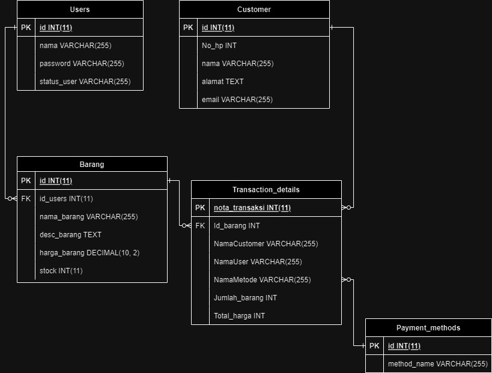

#### Deskripsi Program
Program ini adalah aplikasi berbasis baris perintah yang dirancang untuk mengelola sistem yang menangani berbagai fungsi terkait otentikasi pengguna, pengelolaan produk, pelanggan, detail transaksi, dan metode pembayaran. Program ini melibatkan fungsi-fungsi seperti login, operasi CRUD untuk pengguna, produk, pelanggan, detail transaksi, dan metode pembayaran.

#### Setup Sistem

Untuk menjalankan program ini, pastikan bahwa Anda telah menginstal bahasa pemrograman Go di mesin Anda.

### Persiapan Sebelum Menjalankan Program

Sebelum menjalankan program, Anda perlu membuat entri admin (pengguna dengan hak akses admin) di dalam database. Ikuti langkah-langkah di bawah ini:

### Langkah 1: Akses Database

Akses database yang digunakan oleh program Anda, apakah itu MySQL, PostgreSQL, SQLite, atau database lainnya.

### Langkah 2: Tabel Pengguna (User) 

Pastikan Anda memiliki tabel User atau tabel yang sesuai untuk menyimpan informasi pengguna (admin) dalam database Anda. Jika tabel tersebut belum ada, buatlah dengan struktur yang sesuai dengan kebutuhan aplikasi Anda.

### Langkah 3: Insert Data Admin

Tambahkan entri admin ke dalam tabel User. Untuk contoh program yang Anda berikan, mungkin Anda perlu memasukkan data admin dengan informasi seperti Nama, Password, Status_users, atau atribut lain yang diperlukan.

Contoh perintah SQL untuk memasukkan admin ke dalam tabel User:

INSERT INTO User (Nama, Password, Status_users) VALUES ('NamaAdmin', 'PasswordAdmin', 'admin');

Pastikan untuk mengganti 'NamaAdmin' dan 'PasswordAdmin' dengan nilai yang sesuai untuk admin yang ingin Anda buat. Perhatikan bahwa penggunaan password dalam format terenkripsi atau disarankan menggunakan teknik hashing password untuk keamanan.

### Langkah 4: Jalankan Program

Setelah menambahkan entri admin ke database, Anda dapat menjalankan program. Program akan mencoba mengautentikasi pengguna berdasarkan informasi yang Anda masukkan ke dalam database.

### Catatan Penting:

- Pastikan informasi yang Anda masukkan ke dalam database (terutama kata sandi) disimpan secara aman dan terenkripsi.
- Pastikan bahwa kolom dan struktur tabel yang Anda buat cocok dengan apa yang diharapkan oleh program Anda.

#### Dependensi
Beberapa paket Go yang digunakan dalam program ini:
- kelompok1ALTABE19/auth: Menangani otentikasi pengguna.
- kelompok1ALTABE19/config: Mengelola konfigurasi database.
- kelompok1ALTABE19/controller: Berisi kontroler untuk mengelola komponen sistem yang berbeda.
- kelompok1ALTABE19/model: Mendefinisikan model-model database.

#### Gambaran Fungsionalitas

Fungsionalitas dalam program ini termasuk:
- Otentikasi Pengguna: Login, peran pengguna (admin/karyawan).
- Manajemen Produk: Menambah, melihat, memperbarui, menghapus produk, dan memperbarui stok.
- Manajemen Metode Transaksi: Menambah, melihat, memperbarui, menghapus metode pembayaran.
- Manajemen Data Pelanggan: Menambah, melihat, memperbarui, menghapus detail pelanggan.
- Detail Transaksi: Menambah, melihat, memperbarui, menghapus detail transaksi.

### Disclaimer
README ini berfungsi sebagai panduan umum tentang program dan fungsionalitasnya. Untuk informasi lebih detail, struktur kode, dan detail implementasi tambahan, harap merujuk ke kode sumber dalam file Go yang bersangkutan.

Ini adalah panduan untuk memahami fungsionalitas program dan langkah-langkah awal sebelum dijalankan. Untuk detail yang lebih mendalam, analisis kode, atau pertanyaan spesifik, silakan lihat kode atau berkonsultasi dengan pengembang.

